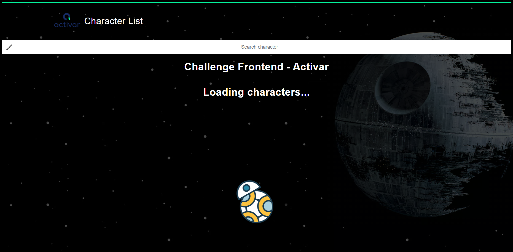
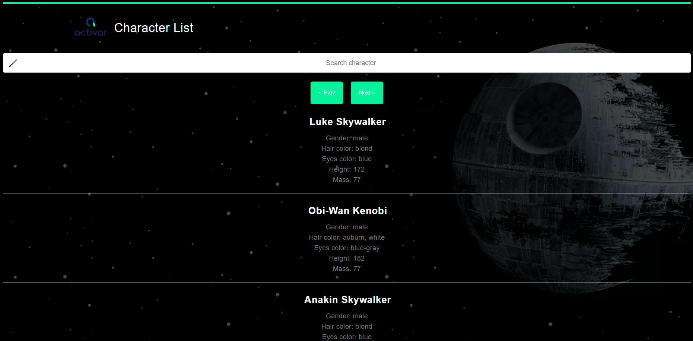
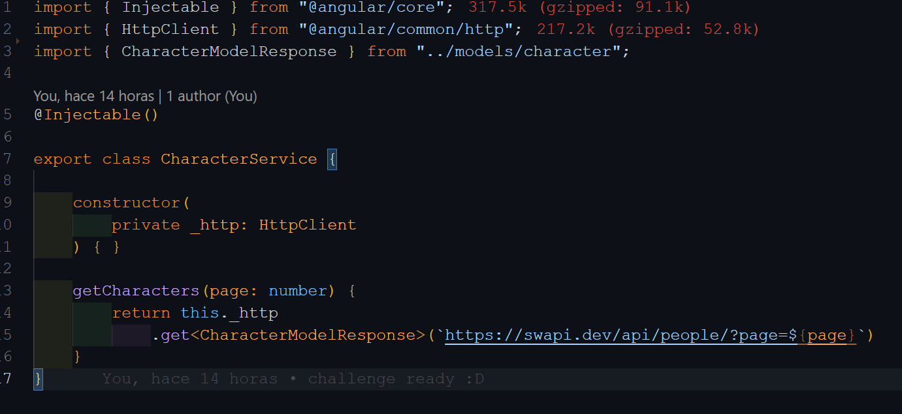
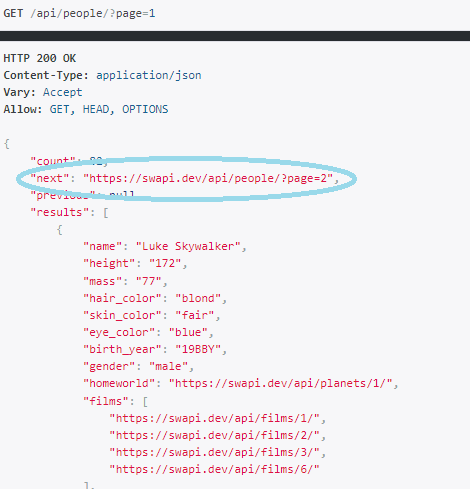
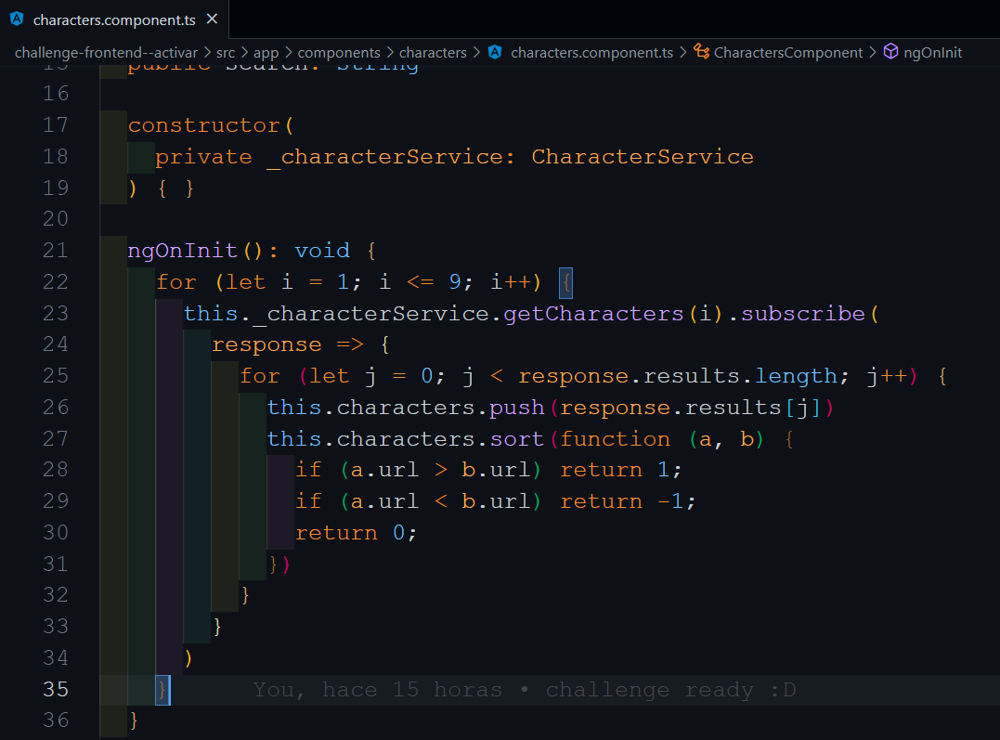
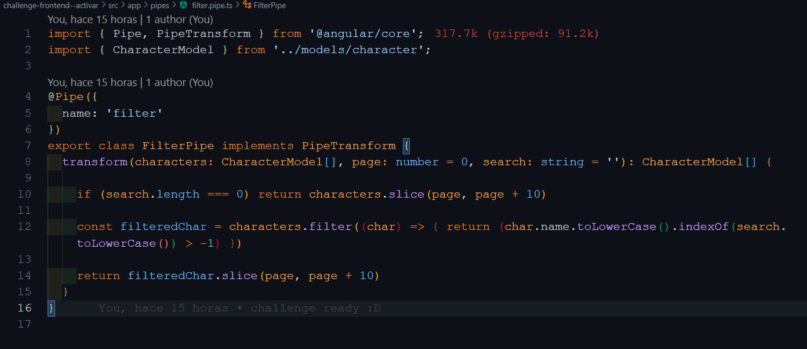

<p align='left'>
    
</p>

# Challenge Frontend - Activar

<p align="left">
  
</p>
<p align="left">
  
</p>

## Objetivos del Challenge.

    ✅ Armar un listado de personajes de Star Wars con la siguiente API https://swapi.dev/.

    ✅ El mismo tiene que estar hecho en la última versión de Angular, con typescript, y debe tener un servicio, al menos un componente, y se debe utilizar sass para el css.

## Objetivos extras que me parecio buena idea realizar.

    ✅ Searchbar para que el usuario pueda buscar sus favoritos entre los personajes que se reciben de la API.

    ✅ Paginado para que pueda tener una interacción con la página y para que no reciba de golpe los 82 personajes que se pueden recibir de la API.
    
    ✅ La misma cuenta con responsive web desing adaptado a todo tipo de pantalla (me gusto mucho más como quedo la versión mobile que la desktop).

## Tecnologias utilizadas 💻

<div align="left">  
<a href="https://www.typescriptlang.org/" target="_blank"></a>  
<a href="https://angular.io/" target="_blank"></a>  
<a href="https://sass-lang.com/" target="_blank"></a>  
<a href="https://github.com/" target="_blank"></a>  
</div>

# Requisitos para ejecutarla localmente ⚙

Instalacion ⚙:

Utilizar el administrador de paquetes npm para instalar. Utilizar el siguiente comando dentro de ./challenge-frontend--activar:

```
npm install ⚙
```

# Ejecutar local ⚙

-FrontEnd: Dentro ./challenge-frontend--activar:

```
ng serve
```

## Hablemos un poco de código y funcionalidades 💻:

<p align="left">
  
</p>

En mi archivo "character.service.ts" cree la función que me permite traerme la información que me llega de la API, con el detalle de que quise pasarle por params el numero de página ya que me trae un listado distinto según el número de página de hasta un máximo de 10 personajes:

<p align="left">
  
</p>
Luego de crear eso, en la ruta que aparece en la siguiente imagen, recorrí a través de un ciclo for el número máximo de páginas que se podía recibir de la API, y a través del subscribe y de recorrer todo lo que recibía del arreglo de personajes en results, fui pusheando a mi variable characters y ordenandolos (esto lo realice más que nada porque me gustaba que quede uno de mis personajes favoritos de primeras).

<p align="left">
  
</p>

## Tema Pipe

A esta pipe la implemente principalmente con la intención de manejar las respuestas que podía recibir el usuario, es muy sencilla, recibe por parametros characters (los personajes que me traigo de la api), page (el número de página para mostrar un numero específico de personajes por página), y search (que es lo que ingreso a través de la barra de busqueda para buscarlo tanto en mayuscula, como minuscula)

<p align="left">
  
</p>

Y maneje las respuesta de la siguiente manera:
✅ Si characters.length > 80 que me imprima los personajes (por lo que recibo 82 personajes de la API). 
El botón de next va a contar con el disaled en caso de que de characters pasado por la pipe sea igual a un arreglo vacío.

✅ Mi ng-container va a contar con un *ngFor para que me imprima solamente characters pasado por la pipe (para que así solo me imprima los 10 personajes por página).

✅ Maneje el mensaje de error a través de un *ngIf con la misma condición que aplique al botón de next se encuentre desahibilitado.

✅ Por último solo un loader para que el usuario no vea la pantalla en blanco mientras se cargan los pedidos a la API.


# Espero lo disfruten y mi challenge sea de vuestro agrado, muchas gracias por la oportunidad... 😉
